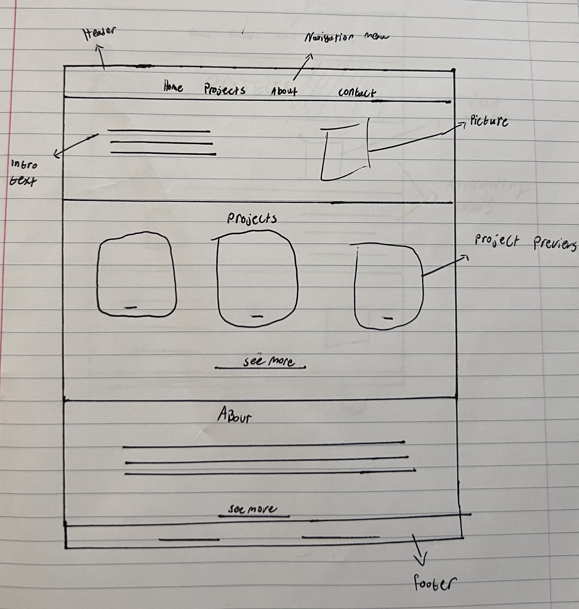
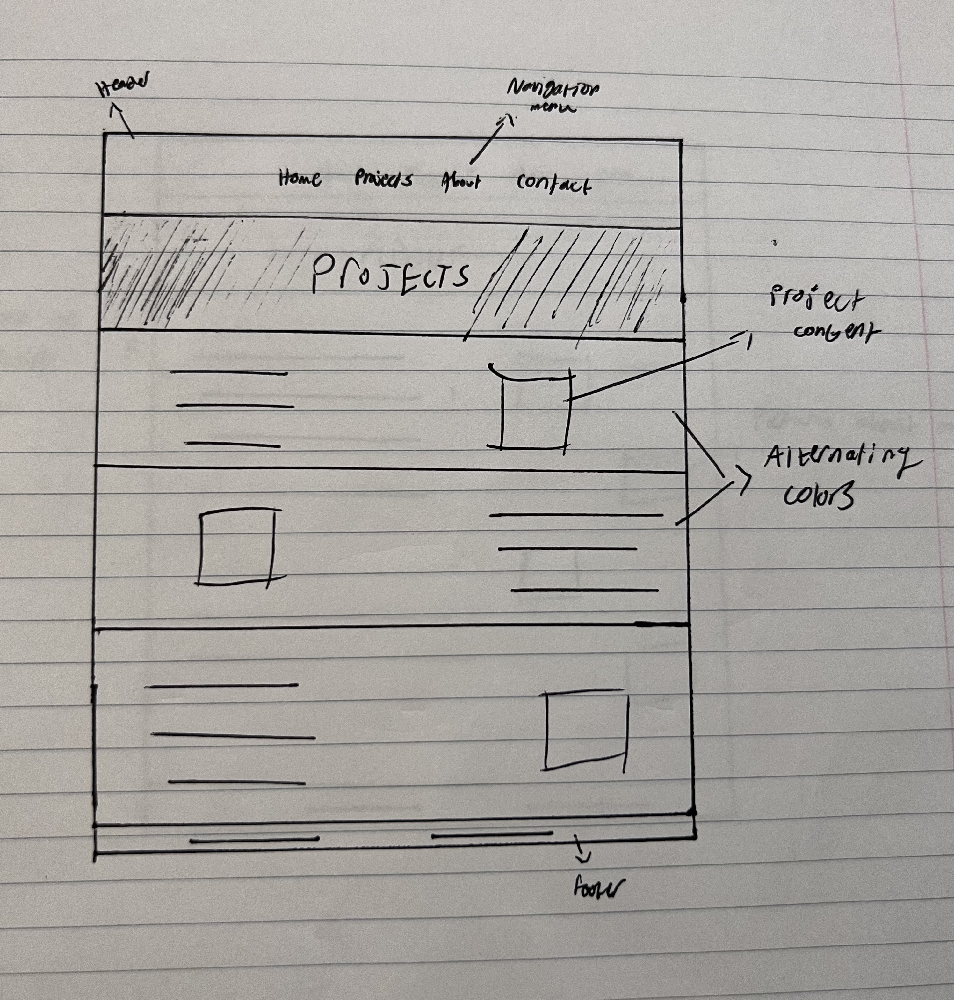
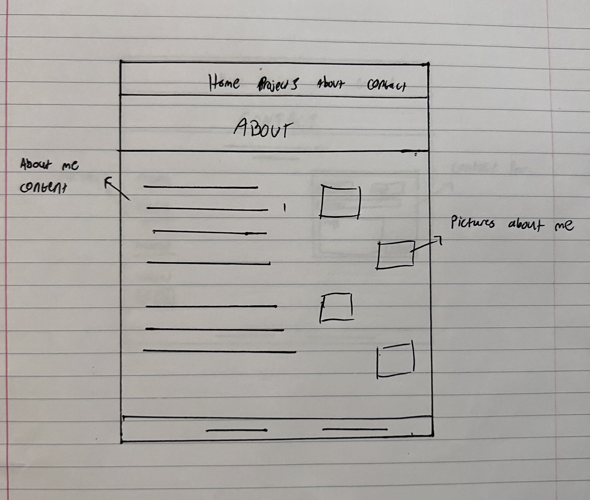
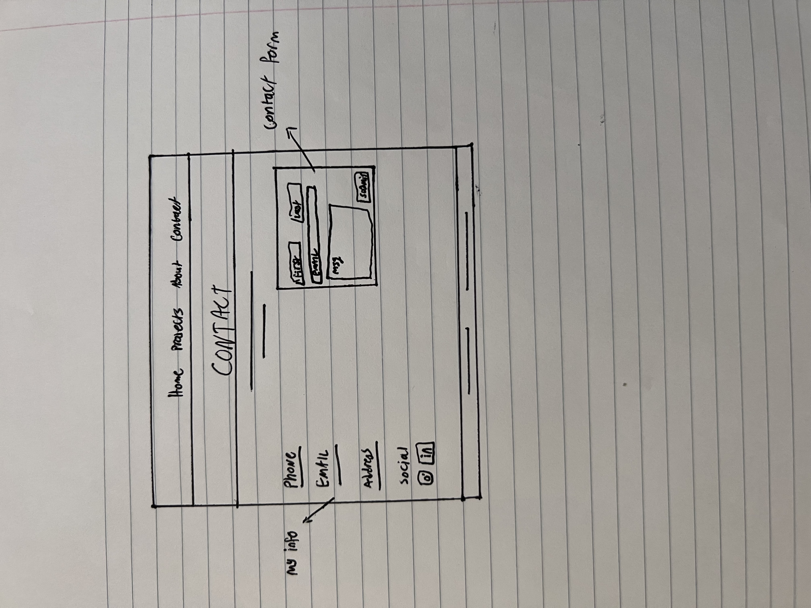

# Ibrahim Shkoukani INF6420 Project

A portfolio site showcasing my work.

## Home page wireframe

Header - will include the navigation menu, a brief introduction about myself with, and a picture at the top.

Navigation Menu - will include links to all other pages.

Main content - Two sections that preview the projects and about pages.

Footer - will include copyright, contact, and socials information.
        

## Projects page wireframe

Header - will include the navigation menu and a block with the title of the page.

Navigation Menu - will include links to all other pages.

Main content - The projects page will be alternating blocks of color, each block to contain text on one side and pictures on the other which will also alternate with each block. 

Footer - will include copyright, contact, and socials information.

## About page wireframe

Header -  will include the navigation menu and a block with the title of the page.

Navigation Menu - will include links to all other pages.

Main content - The about page will have text on the left side with a zigzag picture pattern stretching down the right side.

Footer - will include copyright, contact, and socials information.

## Contact page wireframe

Header -  will include the navigation menu and a block with the title of the page.

Navigation Menu - will include links to all other pages.

Main content - Left side will contain personal information with the right side being a contact form.

Footer - will include copyright, contact, and socials information.